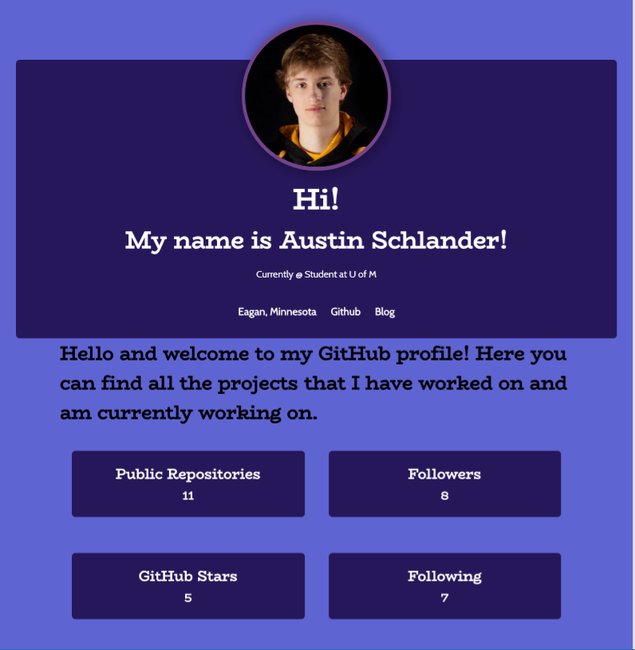
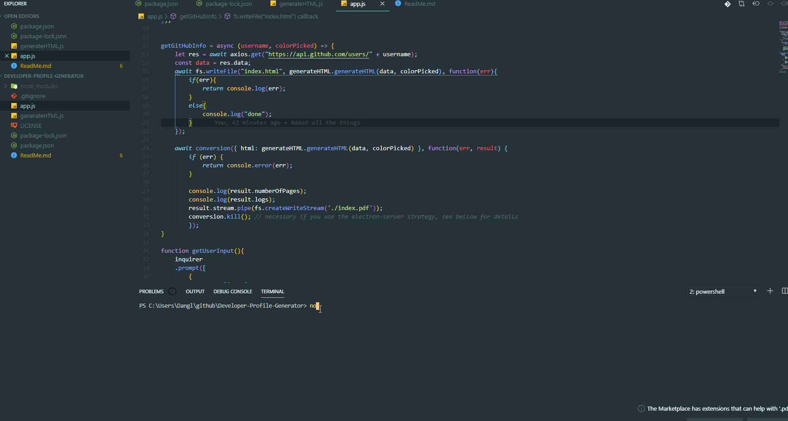

# Developer Profile Generator

A command line application that lets a user search for a github username and pick a background color from 4 options to generate a resume for the selected username.

# ScreenShots

# GIF

# Built With

NodeJS, Inquierer, Axios, and GitHub API

# Authors

Austin Schlander
